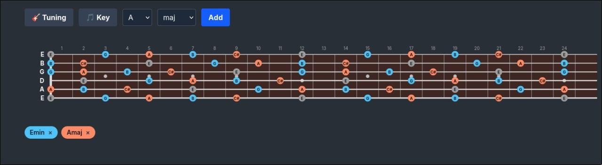
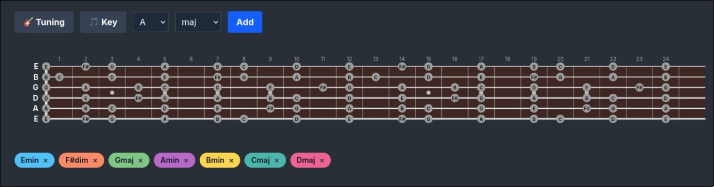

# 🎸 Fretboard Visualizer

An interactive guitar fretboard visualization tool built with Elixir and Phoenix LiveView. See chord notes light up across the neck in real time — no page reloads, no JavaScript frameworks.

Built for guitarists who want to **understand** the fretboard, not just memorize shapes.

## ✨ What It Does

- **Visualize chord notes** across all 24 frets — see where every C, E, and G lives when you select C major
- **Stack multiple chords** with distinct colors — compare C major and A minor side by side, spot shared notes instantly
- **11 chord types** — major, minor, dim, aug, sus2, sus4, 7, maj7, min7, dim7, m7b5
- **Custom tunings** — 9 presets (Standard, Drop D, DADGAD, Open G, and more) plus per-string fine tuning
- **Shareable URLs** — every chord/tuning combination generates a unique URL you can share or bookmark
- **Overlap detection** — notes shared between chords are highlighted with tooltips showing which chords contain them

## 📸 Screenshots

**Multi-chord visualization** — E minor and A major side by side, overlapping notes in grey:



**Key mode** — All diatonic chords of E minor loaded at once with distinct colors:



## 🎯 Who Is This For?

- **Beginners** learning where notes live on the fretboard
- **Intermediate players** exploring how chords relate to each other
- **Theory nerds** who want to see interval patterns across tunings
- **Teachers** who need a quick visual aid for explaining chord construction

## 🏗️ Tech Stack

| Layer | Tech |
|-------|------|
| Language | Elixir 1.19 |
| Web | Phoenix 1.8 + LiveView 1.1 |
| Rendering | Native SVG in HEEx templates |
| Database | None — all state lives in the LiveView process |
| JS | Zero custom JavaScript |

## 🚀 Getting Started

### Prerequisites

- Elixir ~> 1.15
- Erlang/OTP 27+

### Setup

```bash
git clone https://github.com/Ironjanowar/fretboard.git
cd fretboard
mix setup
mix phx.server
```

Then open [localhost:4000](http://localhost:4000).

### Run Tests

```bash
mix test
```

## 🏛️ Architecture

The project follows a clean domain separation:

```
lib/
├── fretboard/
│   └── music/          # Domain logic (notes, chords, tunings, scales)
│       ├── note.ex     # 12 chromatic notes, transposition
│       ├── chord.ex    # Chord formulas and note calculation
│       ├── tuning.ex   # Tuning presets and custom tunings
│       ├── scale.ex    # Scale formulas
│       └── url_codec.ex # URL serialization for shareable links
└── fretboard_web/
    └── live/           # LiveView UI, SVG rendering
```

**Key design rule:** The web layer talks only to `Fretboard.Music` (the facade module). Internal music modules are never called directly from LiveView.

## 🗺️ Roadmap

- [ ] **Keys / Tonalities** — select a key (e.g., C major) to load all its diatonic chords at once
- [ ] Scale visualization (major, minor, pentatonic, modes)
- [ ] Interval display (root, 3rd, 5th, 7th...)
- [ ] Chord voicing diagrams
- [ ] Note audio playback
- [ ] Mobile / responsive layout
- [ ] Extended chords (9th, 11th, 13th)

## 📄 License

MIT

## 🤝 Contributing

PRs welcome! The project uses Credo in strict mode and has a pre-commit hook that runs the full test suite + linter.

```bash
mix credo --strict
mix test
```
