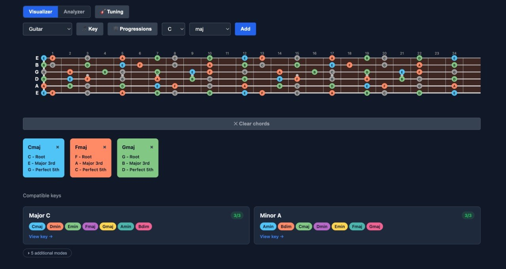
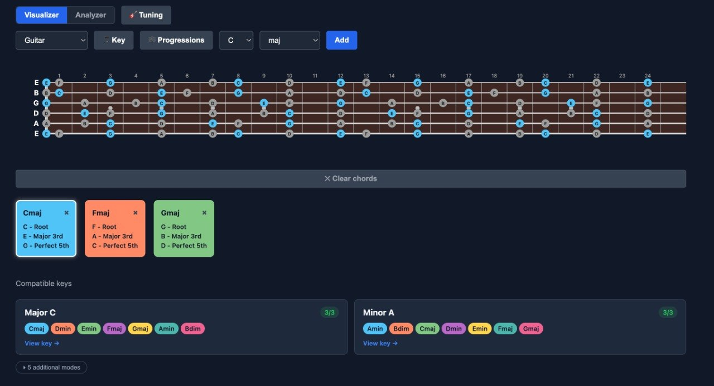
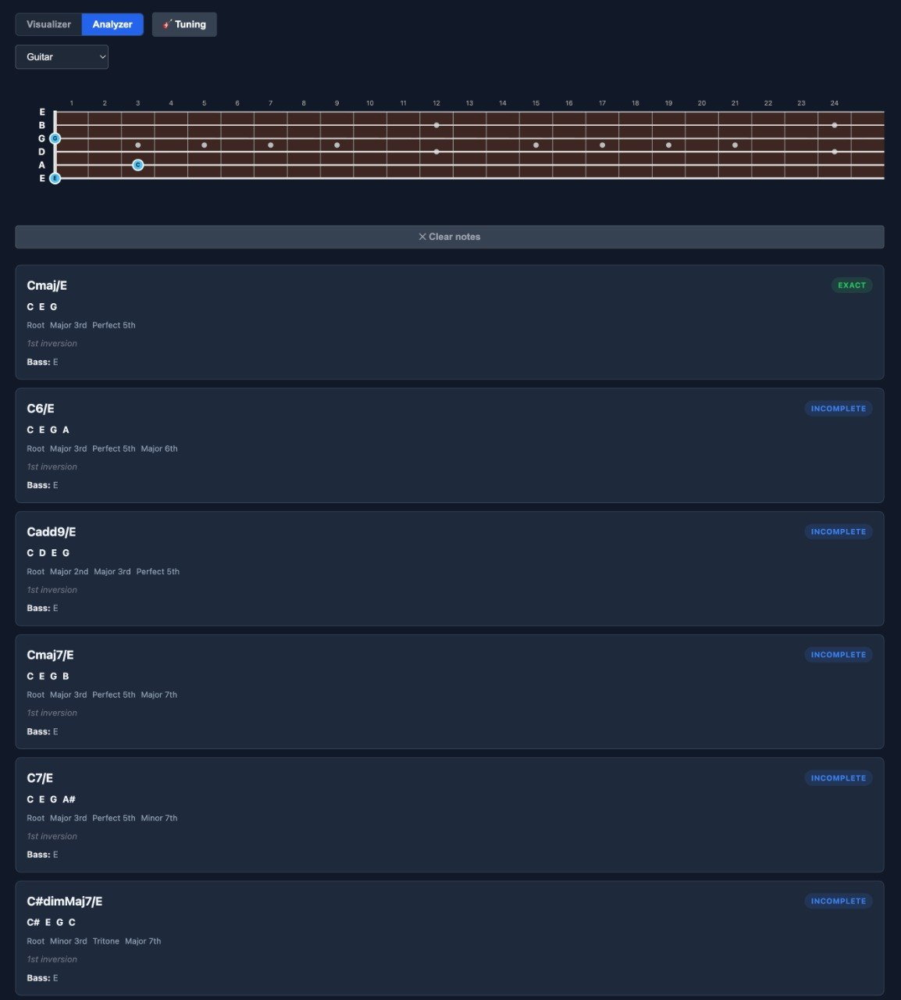
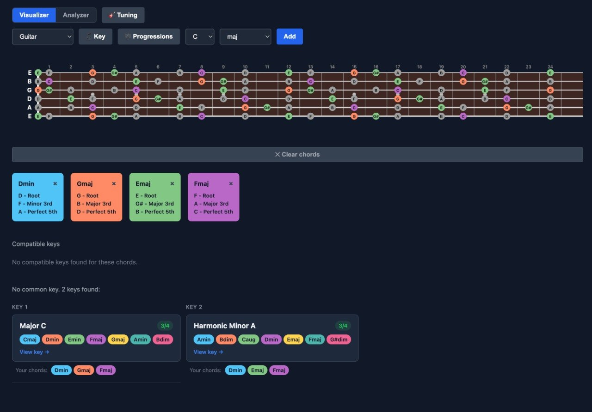

# 🎸 Fretboard Visualizer

An interactive fretboard visualization tool built with Elixir and Phoenix LiveView. See chord notes light up across the neck in real time — no page reloads, no JavaScript frameworks.

Built for guitarists who want to **understand** the fretboard, not just memorize shapes.

## ✨ What You Can Do

- **Compare chords** — stack multiple chords with distinct colors and see where every note lives across 24 frets; notes shared between chords turn grey
- **Highlight a specific chord** — click a chord chip to make its notes stand out from the shared ones
- **Identify chords from the fretboard** — click notes in the Analyzer tab and get matching chords with intervals, inversions, and bass note (slash chords); incomplete voicings are matched too
- **Find compatible keys** — with several chords selected, the app suggests keys that fit them, with a preview of their diatonic chords
- **Explore chord progressions** — load a progression (pop, jazz, blues, flamenco, modal…) in any tonic
- **Switch instruments and tunings** — guitar, 4- and 5-string bass, and ukulele, each with named tuning presets (Standard, Drop D, DADGAD, Open G, Low G…) or per-string custom tunings
- **44 chord types** — from triads to 13ths, including suspended and altered chords
- **Share what you see** — every state (chords, marked notes, instrument, tuning) lives in the URL: bookmark it or send it to a friend

## 📸 Screenshots

**Compare multiple chords** — shared notes in grey:



**Highlight a specific chord** — its notes stand out from the shared ones:



**Identify chords from selected notes** — the Analyzer shows matching chords with intervals, inversions, and bass:



**Find compatible keys** — suggestions with diatonic chord previews:



## 🎯 Who Is This For?

- **Beginners** learning where notes live on the fretboard
- **Intermediate players** exploring how chords relate to each other
- **Theory nerds** who want to see interval patterns across tunings
- **Teachers** who need a quick visual aid for explaining chord construction

## 🚀 Running It Locally

Requires Elixir ~> 1.15 and Erlang/OTP 27+.

```bash
git clone https://github.com/Ironjanowar/fretboard.git
cd fretboard
mix setup
mix phx.server
```

Then open [localhost:4000](http://localhost:4000).

## 🏛️ Architecture (for developers)

The domain logic (notes, chords, scales, tunings) lives in `Fretboard.Music` and is fully tested without any web concerns; the LiveView layer talks only to that facade and renders native SVG. All state is URL-encoded — no database, no accounts.

See [CHANGELOG.md](CHANGELOG.md) for notable changes.

## 📄 License

[MIT](LICENSE)